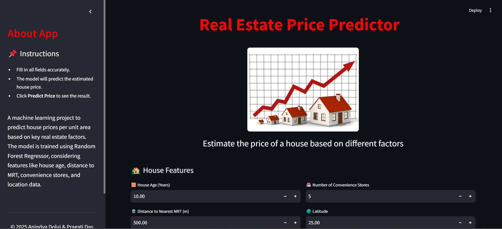

# Real Estate Prediction



<p align="center">
  <a href="https://real-estate-prediction.streamlit.app/">Demo app</a>
</p>

This repository contains a machine learning project that predicts house prices based on features like house age, distance to the nearest MRT station, number of convenience stores, latitude, and longitude. The model is trained using Random Forest Regressor to analyze these factors and estimate the price per unit area.

## Files in this Repository

- **`app.py`**: A Streamlit application for predicting house prices based on user input.
- **`model.py`**: A python script demonstrating data preprocessing, model training, and evaluation.
- **`real_estate_model.joblib`**: The trained Random Forest model serialized using joblib for predictions.
- **`scaler.joblib`**: A `StandardScaler` object used for feature scaling before prediction.
- **`Real Estate.csv`**: The dataset used for training the model.
- **`gitignore`**: A file specifying which files or directories should be ignored by Git.
- **`license`**: The license file for this repository.

## Project Overview

The dataset includes features such as:
- **X1 Transaction Date**
- **X2 House Age**
- **X3 Distance to the Nearest MRT Station**
- **X4 Number of Convenience Stores**
- **X5 Latitude**
- **X6 Longitude**
- **Job Satisfaction**
- **Sleep Duration**
- **Suicidal Thoughts History**
- **Work/Study Hours**
- **Financial Stress**
- **Family History of Mental Illness**
- **City**
- **Profession**
- **Dietary Habits**
- **Degree**

The target variable is `Y House Price of Unit Area`

## Installation

To run the project locally, you will need the following Python libraries:

```bash
pip install -r requirements.txt

```
## Running the App
After installing the necessary dependencies, you can run the Streamlit app to interact with the model. Follow these steps:

Navigate to the project directory in your terminal.
Run the following command to start the Streamlit app:
```bash
streamlit run app.py
```
Streamlit will start the local server and provide a URL like http://localhost:8501 where you can access the app in your web browser.

## Using the App
Once the app is running, you will be prompted to input several features such as:

House Age
Distance to the Nearest MRT Station
Number of Convenience Stores
Latitude
Longitude

Click "Predict Price" to get an estimated house price per unit area.

## Training the Model
To retrain the model with new data, follow these steps:

Open model.py
Load the dataset `Real Estate.csv`.
Perform data preprocessing (handling missing values, scaling, etc.).
Train a RandomForestRegressor.
Save the trained model and scaler as real_estate_model.joblib and scaler.joblib

## Example of Data Preprocessing
Here’s an overview of the key preprocessing steps performed in the notebook:

## Handle Missing Values:
The column Financial Stress is filled with the median value for missing entries.
Encode Categorical Variables:
Binary categorical variables (Gender, Have you ever had suicidal thoughts?, Family History of Mental Illness) are label-encoded.
Multi-category features like City, Profession, Dietary Habits, and Degree are one-hot encoded.
Scale Numerical Features:
The features such as Age, Academic Pressure, CGPA, Work Pressure, and others are scaled using StandardScaler for uniformity and optimal performance during training.

## Train the Model:
A RandomForestClassifier is trained on the preprocessed data.
The trained model is saved as real_estate_model.joblib using joblib.

## License
This project is licensed under the MIT License - see the LICENSE file for details.
